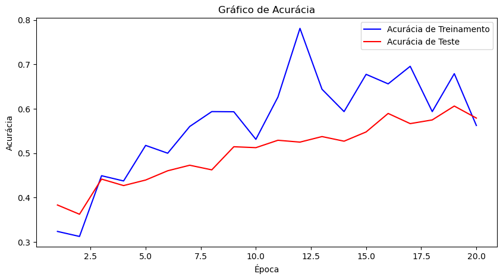

# Trabalho de Aprendizado de Máquinas baseado em redes neurais

## Fundamentos de Inteligência Artificial (ES01)

Integrantes:

- ANA FLÁVIA FREITAS DAS CHAGAS
- CAIO DA SILVA MARTINS
- ERIK FELIPE DA SILVA OLIVEIRA
- LUANE DOS SANTOS LOPES
- PEDRO FRANCISCO FORTE DE ALMEIDA
- RAFAEL FARIAS DE LIMA

Email: 
- anaf.chagas@icomp.ufam.edu.br
- caio.silva@icomp.ufam.edu.br
- erikf.oliveira@icomp.ufam.edu.br
- luane.santos@icomp.ufam.edu.br
- pedro.forte@icomp.ufam.edu.br
- rafael.farias@icomp.ufam.edu.br

---
# 🧩 Projeto 2: Classificação de Lixo para Reciclagem
### 📘 Descrição do Projeto
Este projeto aborda um desafio real na área de reciclagem e gestão de resíduos, tema de grande relevância para as discussões sobre sustentabilidade e as metas da COP 30. A triagem automatizada de resíduos pode aumentar significativamente a eficiência dos processos de reciclagem, reduzindo a contaminação entre materiais e otimizando o reaproveitamento de recursos.

O objetivo principal é construir um classificador de imagens multiclasse capaz de categorizar diferentes tipos de lixo em seis classes:
- 🧴 Plastic (Plástico)
- 🧻 Paper (Papel)
- 📦 Cardboard (Papelão)
- 🍾 Glass (Vidro)
- 🥫 Metal (Metal)
- 🗑️ Trash (Lixo Orgânico/Rejeito)

### 🎯 Problema e Objetivo
A separação manual de resíduos é demorada e suscetível a erros. Através da Visão Computacional e Aprendizado Profundo (Deep Learning), é possível automatizar essa triagem, contribuindo para a sustentabilidade ambiental.

O projeto tem como objetivo:
- Receber imagens de resíduos (tamanho padrão 224x224x3).
- Classificar automaticamente o tipo de material.
- Avaliar o desempenho do modelo utilizando métricas

### 📊 Avaliação e Resultados
O modelo foi avaliado com base em duas métricas principais:
- Acurácia: Mede a proporção de previsões corretas em relação ao total de exemplos.
- Matriz de confusão: Permite visualizar em quais classes o modelo apresenta maior confusão.

### 🧾 Resultados Obtidos

Gráfico de Acurácia
Durante o treinamento do modelo que identifica o tipo de lixo nas imagens, foi possível acompanhar como ele foi aprendendo aos poucos a reconhecer melhor cada material (vidro, papel, plástico, metal, papelão e lixo comum).
Conforme o modelo foi treinado mais vezes:
- Ele foi melhorando, chegando a acertar entre 70% a 80% das imagens de treino.
- Nos testes (imagens que ele nunca tinha visto antes), a taxa de acerto ficou entre 50% a 60%.
- O erro do modelo foi diminuindo, o que mostra que ele chegou a aprender alguma coisa sobre as imagens.

A diferença entre o resultado do treino e o do teste indica que o modelo ainda precisa melhorar um pouco mais sobre as imagens.

Matriz de Confusão 

### 🧠 Data Augmentation (DA)
O data augmentation é o processo de gerar artificialmente novos dados a partir de dados existentes, principalmente para treinar novos modelos de machine learning (ML).
Durante o treinamento podemos perceber que durante o treinamento o DA ampliou significativamente as imagens usadas, assim cada tipo de lixo pode ter recebido uma versão variada de si, simulando pequenas situações reais ou não para o modelo. Logo, podemos concluir que o foco do modelo passou a ser o aprendizado direcionado, ou seja, sabia exatamente o que procurar e como identificar ao longo dos testes, o overfitting reduziu, além das melhoras de acurácia nos treinos e testes.

##

   
Engenharia de Software na <a href="https://icomp.ufam.edu.br/">UFAM</a>, disciplina de Fundamento de Inteligência Artificial.

